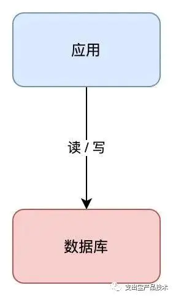
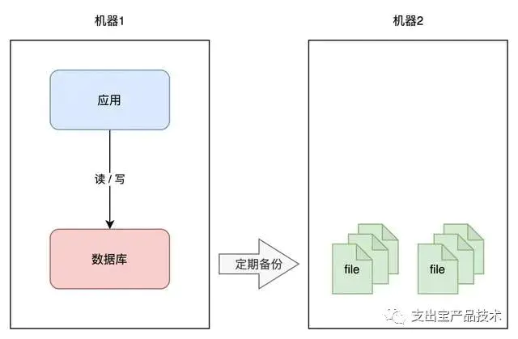
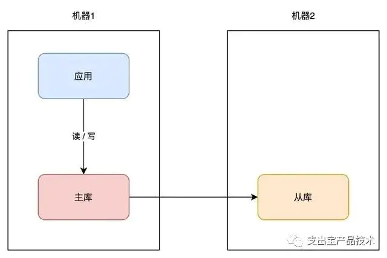
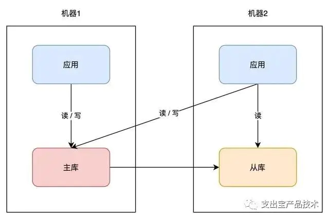
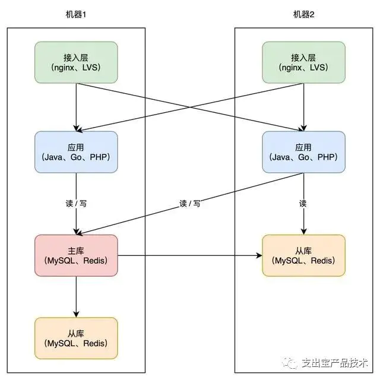
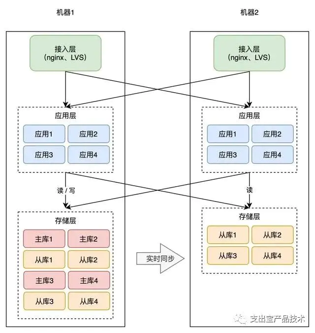
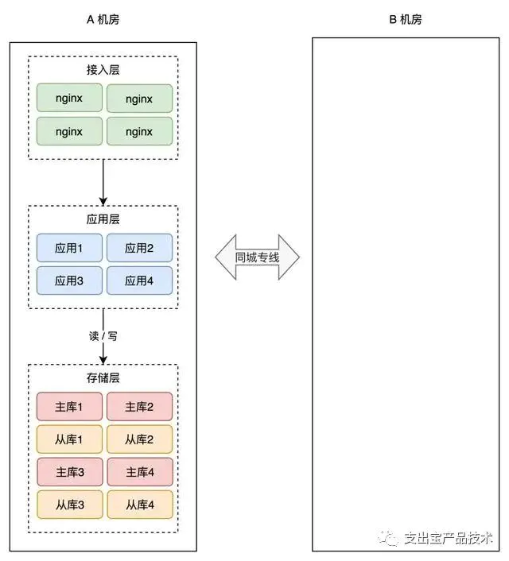
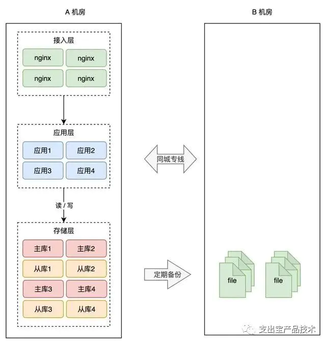
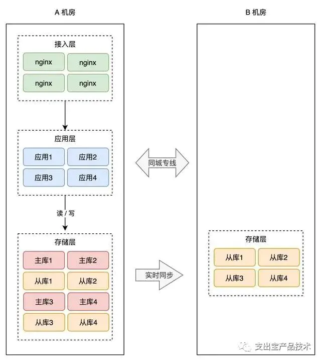

# 【架构】异地多活分布式系统架构设计原理

[Bogon](https://www.jianshu.com/u/e65f29d9cfe1)关注IP属地: 湖北

32022.04.28 00:14:04字数 11,528阅读 2,693

在软件开发领域，「异地多活」是分布式系统架构设计的一座高峰，很多人经常听过它，但很少人理解其中的原理。

**异地多活到底是什么？**

**为什么需要异地多活？**

**它到底解决了什么问题？**

**究竟是怎么解决的？**

这些疑问，想必是每个程序员看到异地多活这个名词时，都想要搞明白的问题。

有幸，我曾经深度参与过一个中等互联网公司，建设异地多活系统的设计与实施过程。

今天，我就来和你聊一聊异地多活背后的的实现原理。

认真读完这篇文章，我相信你会对异地多活架构，有更加深刻的理解。

**这篇文章干货很多，希望你可以耐心读完。**

#  **01 系统可用性**

要想理解异地多活，我们需要从架构设计的原则说起。

现如今，我们开发一个软件系统，对其要求越来越高，如果你了解一些「架构设计」的要求，就知道一个好的软件架构应该遵循以下 3 个原则：

**1. 高性能**

**2. 高可用**

**3. 易扩展**

其中，高性能意味着系统拥有更大流量的处理能力，更低的响应延迟。例如 1 秒可处理 10W 并发请求，接口响应时间 5 ms 等等。

易扩展表示系统在迭代新功能时，能以最小的代价去扩展，系统遇到流量压力时，可以在不改动代码的前提下，去扩容系统。

「高可用」这个概念，看起来很抽象，怎么理解它呢？通常用 2 个指标来衡量：

**平均故障间隔 MTBF**（Mean Time Between Failure）：表示两次故障的间隔时间，也就是系统「正常运行」的平均时间，这个时间越长，说明系统稳定性越高

**故障恢复时间 MTTR**（Mean Time To Repair）：表示系统发生故障后「恢复的时间」，这个值越小，故障对用户的影响越小

可用性与这两者的关系：

可用性**（Availability）= MTBF / (MTBF + MTTR) \* 100%**

这个公式得出的结果是一个「比例」，通常我们会用「N 个 9」来描述一个系统的可用性。

从这张图你可以看到，要想达到 4 个 9 以上的可用性，平均每天故障时间必须控制在 10 秒以内。

也就是说，只有故障的时间「越短」，整个系统的可用性才会越高，每提升 1 个 9，都会对系统提出更高的要求。

我们都知道，系统发生故障其实是不可避免的，尤其是规模越大的系统，发生问题的概率也越大。

这些故障一般体现在 3 个方面：

**硬件故障**：CPU、内存、磁盘、网卡、交换机、路由器

**软件问题**：代码 Bug、版本迭代

**不可抗力**：地震、水灾、火灾、战争

这些风险随时都有可能发生。所以，在面对故障时，我们的系统能否以「**最快**」的速度恢复，就成为了可用性的关键。

可如何做到快速恢复呢？

这篇文章要讲的「异地多活」架构，就是为了解决这个问题，而提出的高效解决方案。

下面，我会从一个最简单的系统出发，带你一步步演化出一个支持「异地多活」的系统架构。

在这个过程中，你会看到一个系统会遇到哪些可用性问题，以及为什么架构要这样演进，从而理解异地多活架构的意义。

# **02 单机架构** 

我们从最简单的开始讲起。

假设你的业务处于起步阶段，体量非常小，那你的架构是这样的：

这个架构模型非常简单，客户端请求进来，业务应用读写数据库，返回结果，非常好理解。

但需要注意的是，这里的数据库是「单机」部署的，所以它有一个致命的缺点：一旦遭遇意外，例如磁盘损坏、操作系统异常、误删数据，那这意味着所有数据就全部「丢失」了，这个损失是巨大的。

如何避免这个问题呢？我们很容易想到一个方案：**备份**。

你可以对数据做备份，把数据库文件「定期」cp 到另一台机器上，这样，即使原机器丢失数据，你依旧可以通过备份把数据「恢复」回来，以此保证数据安全。

这个方案实施起来虽然比较简单，但存在 2 个问题：

**恢复需要时间**：业务需先停机，再恢复数据，停机时间取决于恢复的速度，恢复期间服务「不可用」

**数据不完整**：因为是定期备份，数据肯定不是「最新」的，数据完整程度取决于备份的周期

很明显，你的数据库越大，意味故障恢复时间越久。那按照前面我们提到的「高可用」标准，这个方案可能连 1 个 9 都达不到，远远无法满足我们对可用性的要求。

那有什么更好的方案，既可以快速恢复业务？还能尽可能保证数据完整性呢？

这时你可以采用这个方案：**主从副本**。

# **03 主从副本** 

你可以在另一台机器上，再部署一个数据库实例，让这个新实例成为原实例的「副本」，让两者保持「实时同步」，就像这样：

我们一般把原实例叫作主库（master），新实例叫作从库（slave）。这个方案的优点在于：

**数据完整性高**：主从副本实时同步，数据「差异」很小

**抗故障能力提升**：主库有任何异常，从库可随时「切换」为主库，继续提供服务

**读性能提升**：业务应用可直接读从库，分担主库「压力」读压力

这个方案不错，不仅大大提高了数据库的可用性，还提升了系统的读性能。

同样的思路，你的「业务应用」也可以在其它机器部署一份，避免单点。因为业务应用通常是「无状态」的（不像数据库那样存储数据），所以直接部署即可，非常简单。

因为业务应用部署了多个，所以你现在还需要部署一个「接入层」，来做请求的「负载均衡」（一般会使用 nginx 或 LVS），这样当一台机器宕机后，另一台机器也可以「接管」所有流量，持续提供服务。

从这个方案你可以看出，提升可用性的关键思路就是：**冗余**。

没错，担心一个实例故障，那就部署多个实例，担心一个机器宕机，那就部署多台机器。

到这里，你的架构基本已演变成主流方案了，之后开发新的业务应用，都可以按照这种模式去部署。

但这种方案还有什么风险吗？

# **04 风险不可控** 

现在让我们把视角下放，把焦点放到具体的「部署细节」上来。

按照前面的分析，为了避免单点故障，你的应用虽然部署了多台机器，但这些机器的分布情况，我们并没有去深究。

而一个机房有很多服务器，这些服务器通常会分布在一个个「机柜」上，如果你使用的这些机器，刚好在一个机柜，还是存在风险。

如果恰好连接这个机柜的交换机 / 路由器发生故障，那么你的应用依旧有「不可用」的风险。

虽然交换机 / 路由器也做了路线冗余，但不能保证一定不出问题。

部署在一个机柜有风险，那把这些机器打散，分散到不同机柜上，是不是就没问题了？

这样确实会大大降低出问题的概率。但我们依旧不能掉以轻心，因为无论怎么分散，它们总归还是在一个相同的环境下：**机房**。

那继续追问，机房会不会发生故障呢？

一般来讲，建设一个机房的要求其实是很高的，地理位置、温湿度控制、备用电源等等，机房厂商会在各方面做好防护。但即使这样，我们每隔一段时间还会看到这样的新闻：

**2015 年 5 月 27 日，杭州市某地光纤被挖断，近 3 亿用户长达 5 小时无法访问支付宝**

**2021 年 7 月 13 日，B 站部分服务器机房发生故障，造成整站持续 3 个小时无法访问**

**2021 年 10 月 9 日，富途证券服务器机房发生电力闪断故障，造成用户 2 个小时无法登陆、交易**

...

可见，即使机房级别的防护已经做得足够好，但只要有「概率」出问题，那现实情况就有可能发生。虽然概率很小，但一旦真的发生，影响之大可见一斑。

看到这里你可能会想，机房出现问题的概率也太小了吧，工作了这么多年，也没让我碰上一次，有必要考虑得这么复杂吗？

但你有没有思考这样一个问题：**不同体量的系统，它们各自关注的重点是什么？**

**体量很小的系统，它会重点关注「用户」规模、增长，这个阶段获取用户是一切。**

**等用户体量上来了，这个阶段会重点关注「性能」，优化接口响应时间、页面打开速度等等，这个阶段更多是关注用户体验。
**

**等体量再大到一定规模后你会发现，「可用性」就变得尤为重要。像微信、支付宝这种全民级的应用，如果机房发生一次故障，那整个影响范围可以说是非常巨大的。**

所以，再小概率的风险，我们在提高系统可用性时，也不能忽视。

分析了风险，再说回我们的架构。那到底该怎么应对机房级别的故障呢？

没错，还是**冗余**。

# **05 同城灾备** 

**想要抵御「机房」级别的风险，那应对方案就不能局限在一个机房内了。
**

现在，你需要做机房级别的冗余方案，也就是说，你需要再搭建一个机房，来部署你的服务。

简单起见，你可以在「同一个城市」再搭建一个机房，原机房我们叫作 A 机房，新机房叫 B 机房，这两个机房的网络用一条「专线」连通。

有了新机房，怎么把它用起来呢？这里还是要优先考虑「数据」风险。

为了避免 A 机房故障导致数据丢失，所以我们需要把数据在 B 机房也存一份。最简单的方案还是和前面提到的一样：**备份**。

A 机房的数据，定时在 B 机房做备份（拷贝数据文件），这样即使整个 A 机房遭到严重的损坏，B 机房的数据不会丢，通过备份可以把数据「恢复」回来，重启服务。

这种方案，我们称之为「**冷备**」。为什么叫冷备呢？因为 B 机房只做备份，不提供实时服务，它是冷的，只会在 A 机房故障时才会启用。

但备份的问题依旧和之前描述的一样：数据不完整、恢复数据期间业务不可用，整个系统的可用性还是无法得到保证。

所以，我们还是需要用「主从副本」的方式，在 B 机房部署 A 机房的数据副本，架构就变成了这样：

这样，就算整个 A 机房挂掉，我们在 B 机房也有比较「完整」的数据。